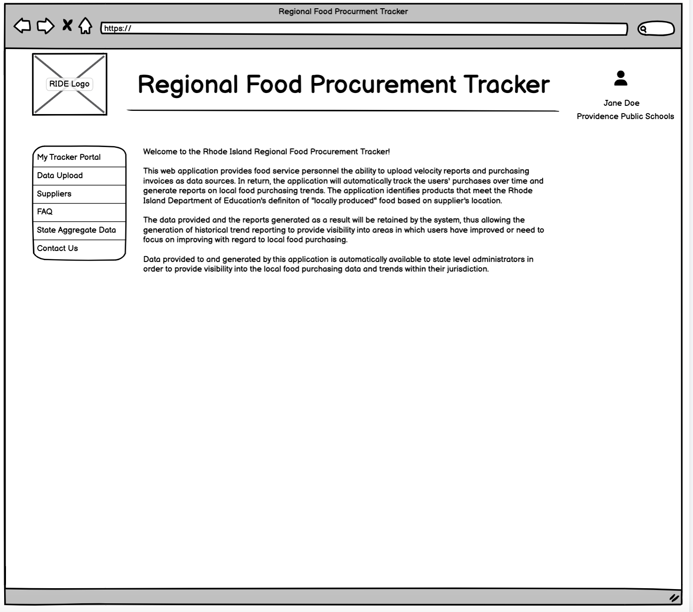
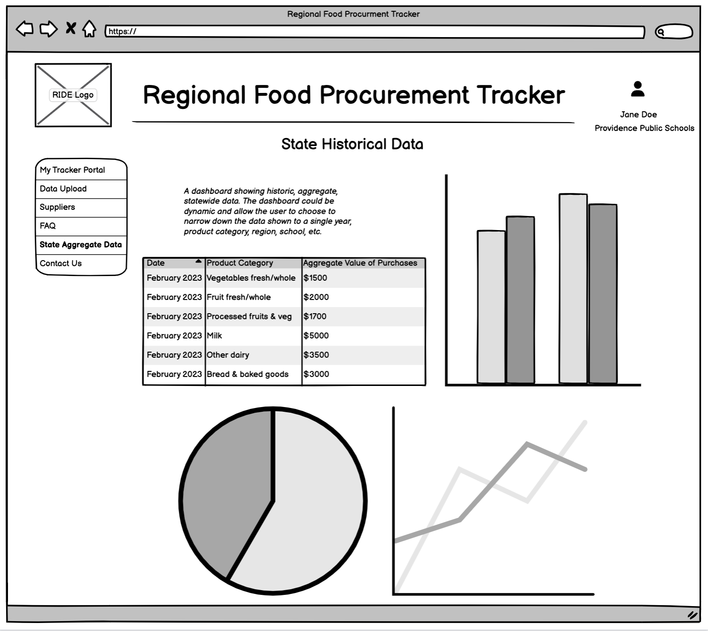
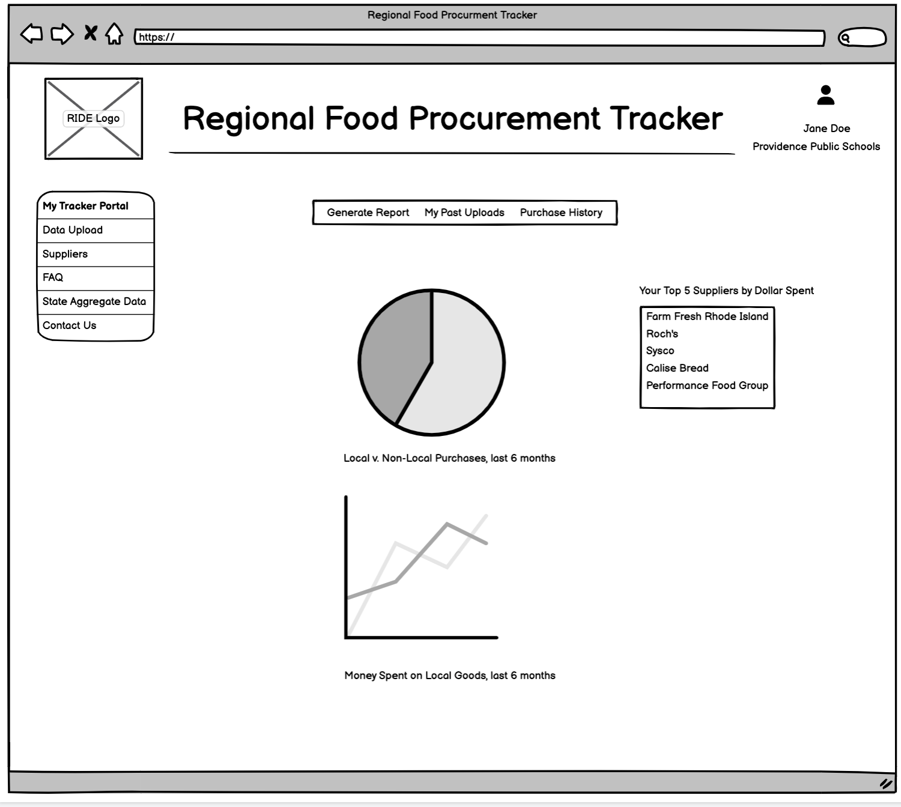
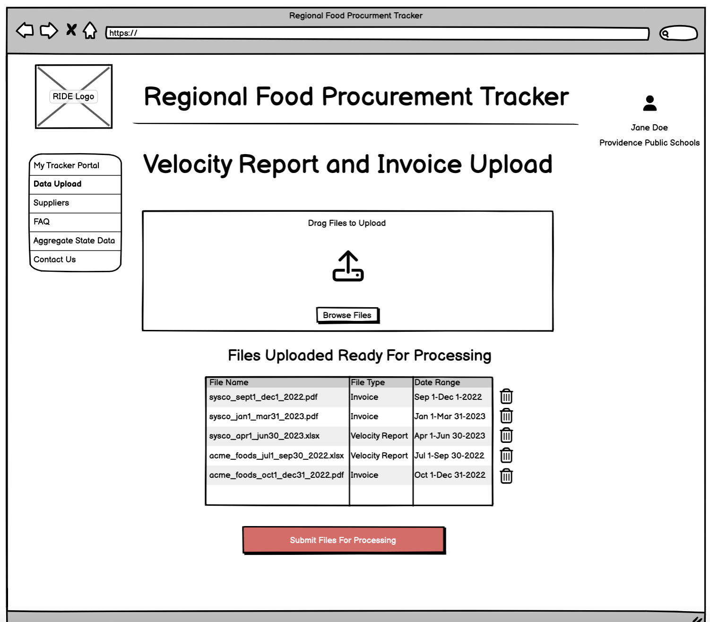
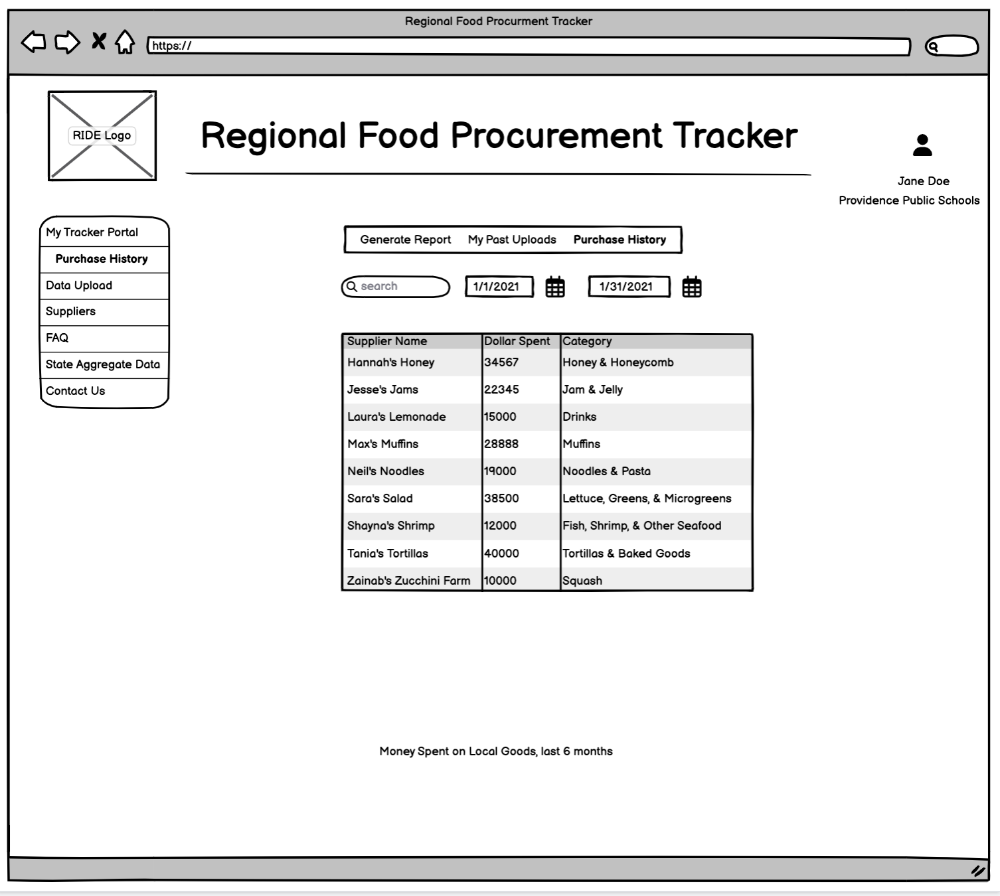
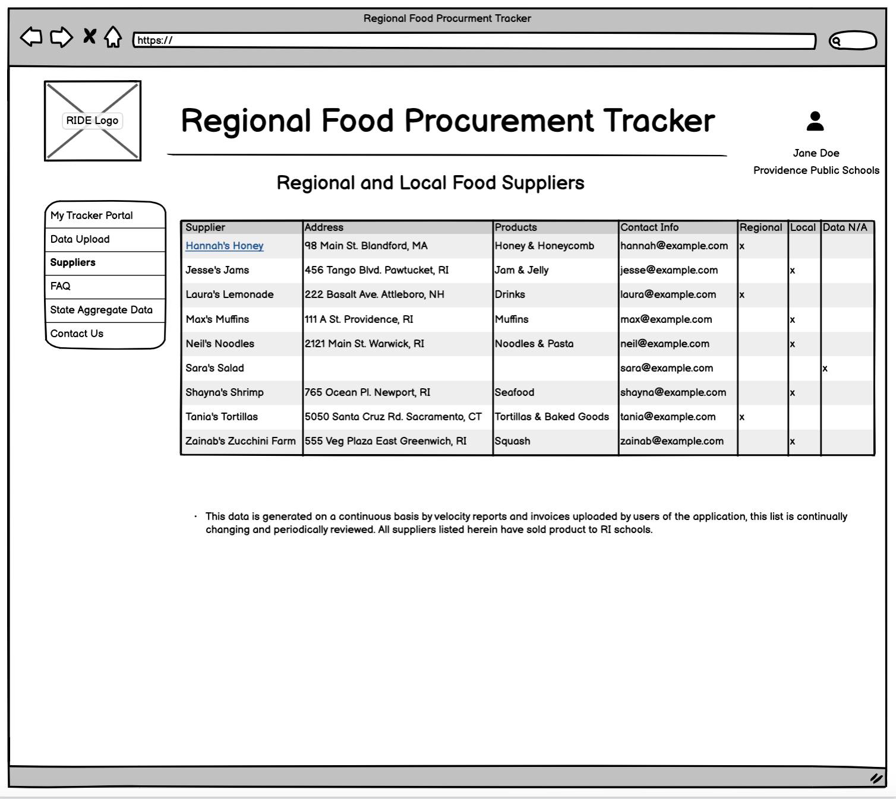

# Wireframe

Introduction to Wireframes

A wireframe is a visual representation of a user interface, created with the primary goal of outlining its structure, layout, and content organization. It is a simplified, low-fidelity blueprint that helps designers, developers, and stakeholders visualize the essential elements and arrangement of a digital project without getting distracted by colors, graphics, or intricate details.

We have provided a wireframe for you to get a sense of what the food tracking platform will look like, the functions it will perform, and how you as a user can interact

# Homepage

Users will be able to log into their account, which will be associated with a facility or multiple facilities which they are responsible for. For example a school food administrator (SFA) will likely have one facility attached to their account, where a state level administrator will be able to view any facility under their responsibility

# State Level Data Display

Members of the public will be able to see non-sensitive data aggregated at a state level, no user account will be required to view this data

# Individual Level Data Display

An individual user will be able to view data associated with their facility, such as the amount of local vs non-local food purchased over the last 6 months. The initial metrics to be displayed have not been finalized.

# Velocity Report Upload

The application gathers data by users uploading velocity reports, which represent a history of purchases over a period of time. The application will automtically parse these velocity reports of onboarded distributors and standardize the units, save the original and cleaned velocity report and enter that data into the facilities record, and therefore the state level record

# Purchase History

After uploading velocity reports, users will be able to review their purchase history by item category and distributor/supplier

# Suppliers

Over time as the application gathers more data it will generate a list of suppliers. The goal is to encourage users to purchase from suppliers which have the products they need and can source the products locally.

